# Autonomous lane following feature development and TurtleBot systems integration using ROS II

| Contributors         | 
| -------------------- |
| Mohammad Zaki Patel  |
| Anirudh Varadarajan  |
| Harkirat Singh Chahal|

## Introduction

In this group project, we aim to solve the problem of path/ lane following for autonomous robots using neural networks and deep-learning computer vision techniques. The goal of the project is to develop a model that can predict the steering angle of the robot based on the input frames from the camera. The project uses TurtleBot hardware equipped with the Oak-d camera for collecting the data, and then the collected data will be used to train and test the deep learning model. 
Since the first draft of the project goals, some of the objectives have been modified to fit within the timeline and project scope. Initially, we were planning to change the location of the camera on the bot to improve the image quality. However, after a feasibility study, we realized that it was better to increase the height and lower the angle of the camera. This adjustment helped us to get a better viewing angle and improve the quality of the image data.
Regarding the data collection experiments, we initially planned to use multiple styles of paths to increase the diversity of the dataset. However, it led to a huge dataset that required more computational resources to process. To overcome this challenge, we decided to use one style of path with passes from both directions and implement data augmentation techniques. This approach helped us to collect diverse data and build a smaller dataset, which reduced the complexity of the data pipeline.
To collect the data, we controlled the TurtleBot with a keyboard and made it go back and forth multiple times on each path. During this process, we captured frame-by-frame images from the Oak-D camera and recorded the wheel angle as well as linear velocity values as labels for each frame. Linear Velocity is a new parameter added to the dataset as it will make it easier to control the robot autonomously with predictions. This gave us a manually recorded dataset that consisted of frame-by-frame path images and linear velocity and steering values as labels.

<figure>

  
  <figcaption>
Figure 1: Project Process Workflow
</figcaption>

</figure>

## Project Scope
The impact of developing a neural network-based solution for autonomous path following for robots is significant, as it can contribute to the development of more advanced and efficient autonomous robots for a variety of applications such as autonomous cars, drones, warehouse material handling robots, etc. Deep Learning techniques provides better learning opportunities for the robot to perform a task as compared to traditional hard coding. This project will drive us to learn new material related to deep learning and computer vision, as well as reinforce our knowledge of robotics and ROS. This project will encourage learning in topics such as systems integration, data collection, data preprocessing, machine learning model design, performance evaluation, which are essential skills for a end-to-end robotics projects with Neural Network application. It will also provide an opportunity to explore different neural network architectures and their applications in robotics. Overall, this project will help me develop a more comprehensive understanding and hands-on experience systems integration and machine learning applications in robotics.

## Data Collection
For the purpose of data collection, We used the Teleop twist keyboard to drive the turtle bot on the Track with the help of the keyboard. This program publishes preset value to /cmd_vel. Feed from the oak-d camera will be published in the topic /color/preview/image. The main objective of the ROS2 node is to subscribe to topics, receive data, and store it on disk. The node subscribes to two topics, /color/preview/image and /cmd_vel, and saves the received data to a local directory. The DataCollectionNode class is the main class that handles the data collection and storage. The constructor initializes the subscribers to the two topics. The cmd_vel_callback method is called whenever a new message is received on the /cmd_vel topic and updates the current_cmd_vel instance variable with the received linear and angular velocities. The image_callback method is called whenever a new message is received on the /color/preview/image topic, converts the image data to a numpy array, saves it to a PNG file in the data directory with a timestamp, and stores the timestamp, image path, and current linear_x and angular_z velocities to a CSV file named data.csv. This can be used as labels for training.

<figure>

  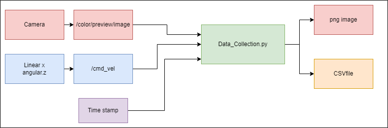
  <figcaption>
Figure 2: Data Collection Process Workflow
</figcaption>

</figure>

<figure>

  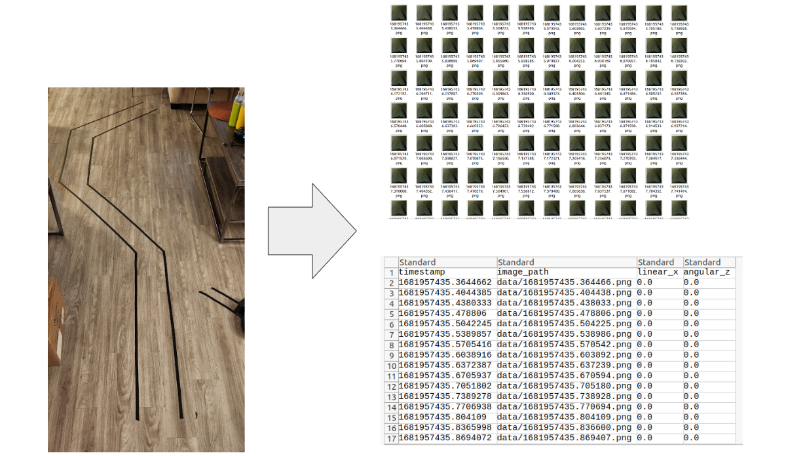
  <figcaption>
Figure 3: Experiment Setup
</figcaption>

</figure>

[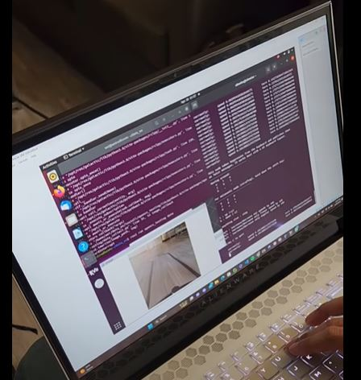](https://youtu.be/dzeqWBgEtBI "Running Data Collection experiment")

Video 1: Data collection experiment

## Building the Model

1. The preprocess_image function is defined to load an image and convert it to a NumPy array of pixel values normalized between 0 and 1.
2. The process_images_parallel function is defined to preprocess multiple images in parallel using a thread pool executor.
3. An array of preprocessed images is created by calling process_images_parallel with an array of image file paths.
4. The labels are preprocessed by encoding them with LabelEncoder and converting them to one-hot-encoded arrays using to_categorical.
5. The data is split into training and validation sets using train_test_split.
6. The model architecture is defined using the Sequential API from Keras, which includes several convolutional and pooling layers, followed by dense layers.
7. The model is compiled with the Adam optimizer, categorical cross-entropy loss, and accuracy as the evaluation metric.
8. The model is trained on the training set with a batch size of 32 and for 10 epochs, with the validation set used for monitoring model performance during training.

<figure>

  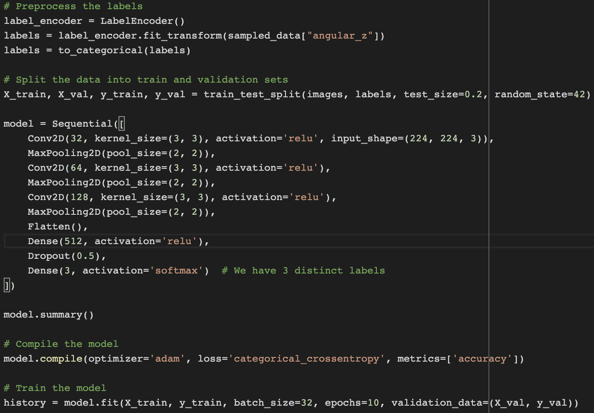
  <figcaption>
Figure 4: CNN Model
</figcaption>

</figure>

## Model Training 
> Challenges in Image Quality and Trade-offs with Filtered Images for Optimizing Speed and Efficiency of a Model

When constructing the model, our main priorities were to optimize its speed and efficiency. Although our dataset was good, it was not flawless. Specifically, the quality of the images posed a challenge due to limited resources. We were unable to provide optimal lighting conditions, resulting in 30-40% of our images being washed out by the reflected light from the floor. Consequently, the track was not clearly visible in some of our images as can be seen in Figure 4 below.

<figure>
  <table>
    <tr>
      <td>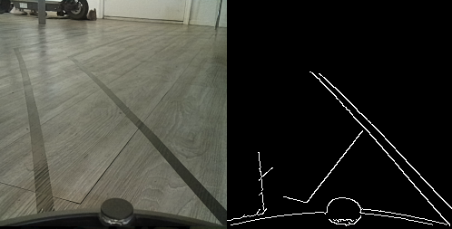</td>
      <td></td>
    </tr>
  </table>
  <figcaption>
Figure 4: Canny Filtered Dataset sample
</figcaption>
</figure>

We decided to stick with raw images instead of the filtered ones to prevent loss of information. 

> Challenges with Utilizing 'angular_z' and 'linear_x' as Labels for Image Classification Model 

At the outset, we had intended to utilize both 'angular_z' and 'linear_x' as labels for our images. The former parameter had three unique values that indicate the direction of movement, namely straight, left, and right. The latter parameter had two distinct values that represent the speed of movement - a constant speed when the Turtlebot moves straight and 0.0 when it comes to a stop to turn. Consequently, six possible combinations of 'angular_z' and 'linear_x' exist. However, when we trained the model using these two labels, the accuracy was disappointingly low, between 55% to 60%. 
We decided to simplify the model by just using ‘angular_z’ as labels to our images and hardcoding a constant speed for the bot instead of using ‘linear_x’, this improved our model accuracy to between 90-92% on the validation dataset.

> Balancing the dataset

Although our dataset comprised 7324 images, it was not well-proportioned. As illustrated in Figure 3, the Turtlebot spent the majority of the time moving in a straight line, and the track only had three turns.

<figure>
  <table>
    <tr>
      <td>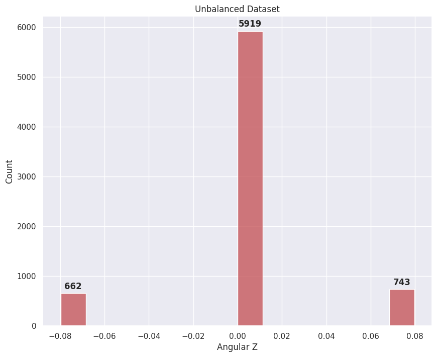</td>
      <td>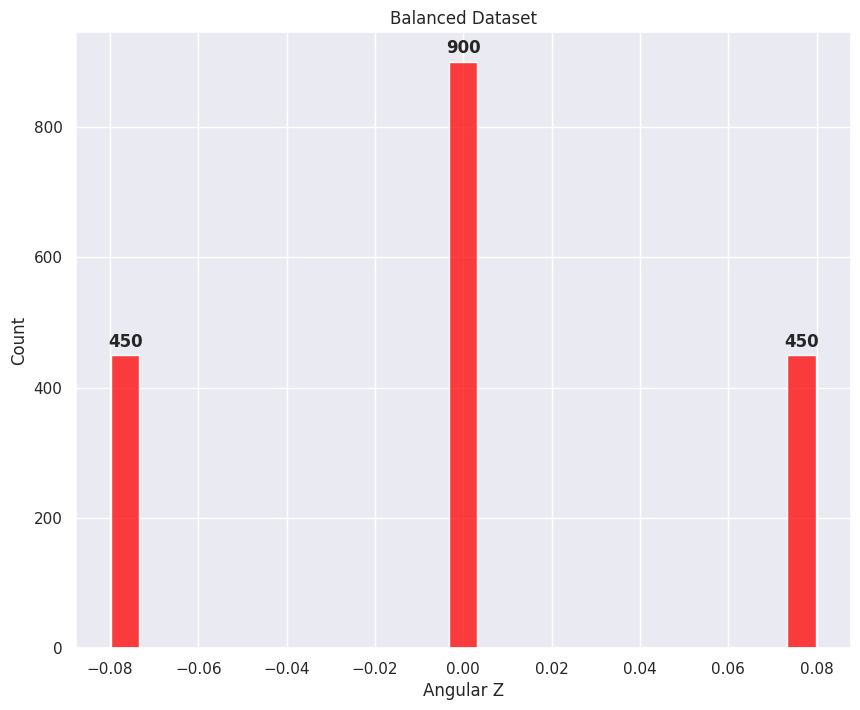</td>
    </tr>
  </table>
  <figcaption>
Figure 5: Canny Filtered Dataset sample
</figcaption>
</figure>

<figure>

  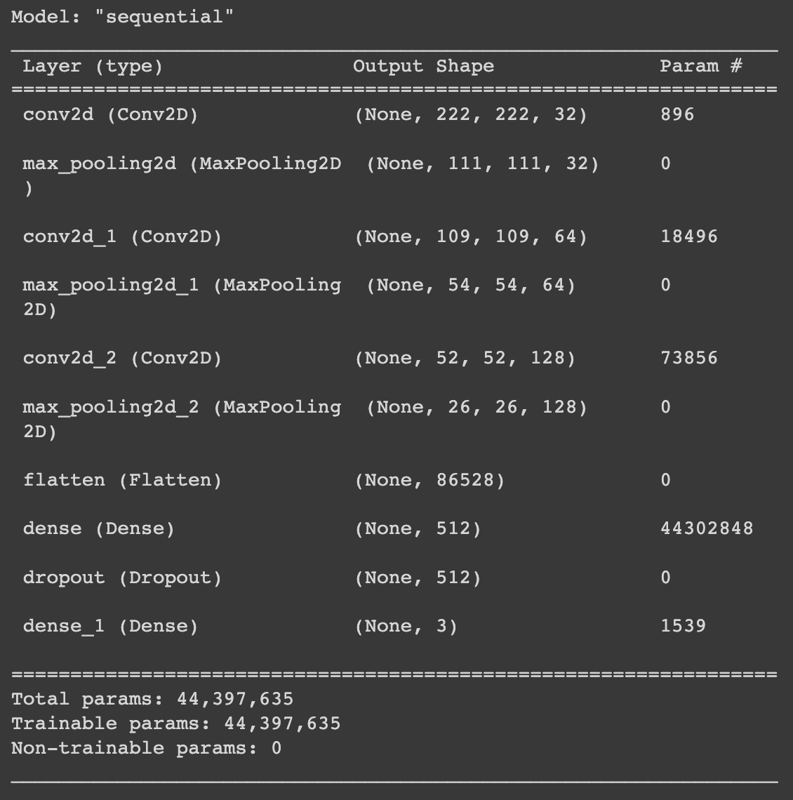
  <figcaption>
Figure 6: Model Parameters
</figcaption>

</figure>

## Model Prediction Evaluation

<figure>
  <table>
    <tr>
      <td>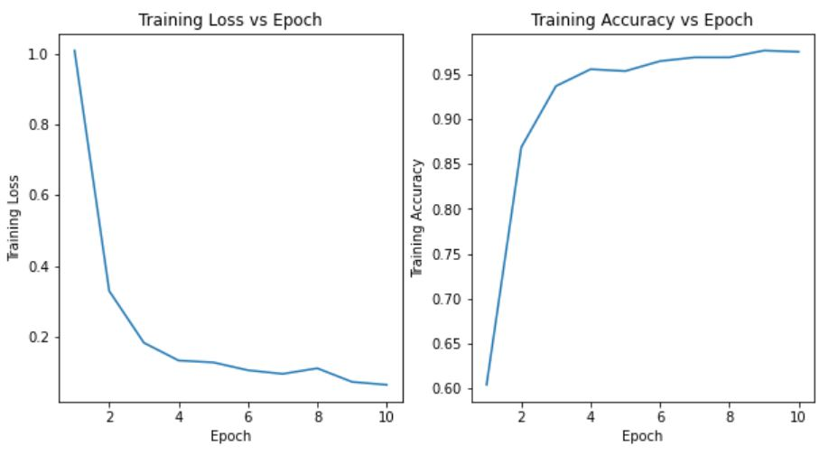</td>
      <td>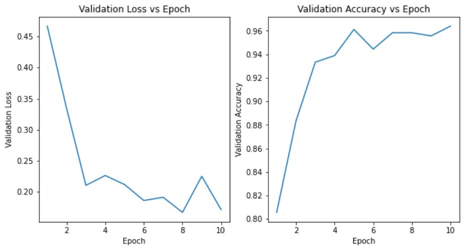</td>
    </tr>
  </table>
  <figcaption>
Figure 7: Evaluation metrics of model training from scratch
</figcaption>
</figure>

<figure>
  <table>
    <tr>
      <td>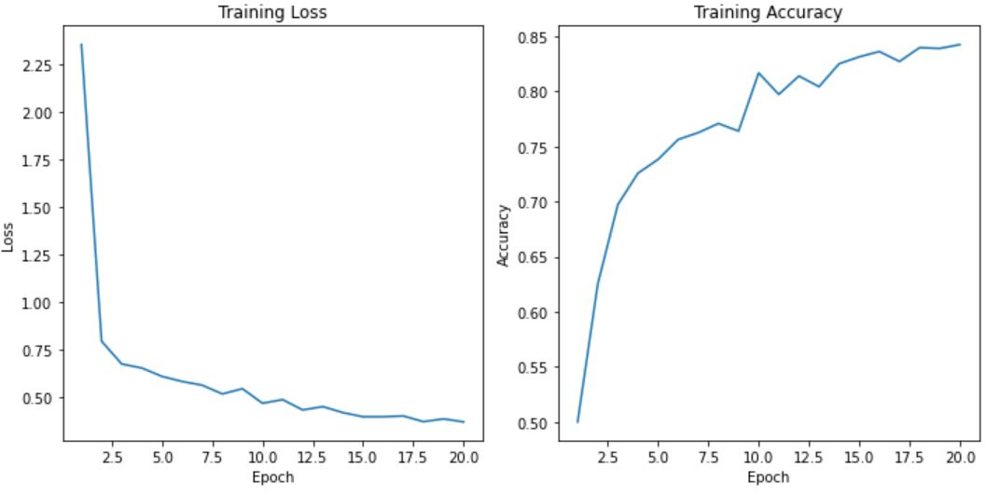</td>
      <td>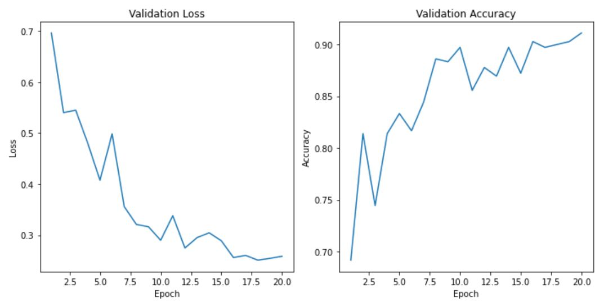</td>
    </tr>
  </table>
  <figcaption>
Figure 8: Evaluation metrics of model training from pre-trained weights
</figcaption>
</figure>

<figure>

  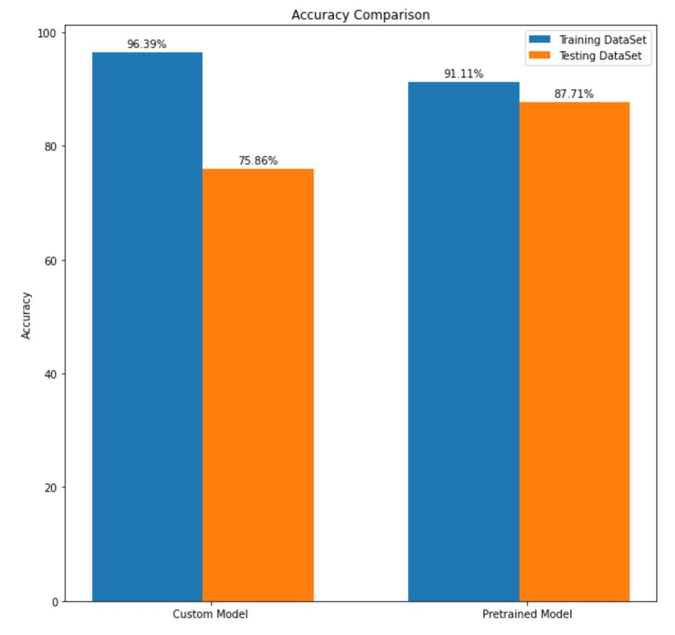
  <figcaption>
Figure 3: Model performance comparison
</figcaption>

</figure>

Once the training is done and the model is trained and saved as a .h file which we can use to predict the angular z and publish it to the topic cmd_vel. As shown in the figure below. It subscribes to the topic /color/preview/image and imports the model. And publish to the topic cmd_vel.
The model predicts the angular_z value. It will predict the value among -0.079766, 0.00000, and 0.079766. These are values of angular z used during data collection. The value is limited to three because we used a keyboard to collect data which gives only preset values For better results, we can use a joystick build for turtlebot to get various angles for angular_z. The value of linear_x is always set to 0.01. The value of linear_x is low for smother turn. If the value of linear_x is high we have to stop the robot and then turn or it may oversteer from the track.

<figure>

  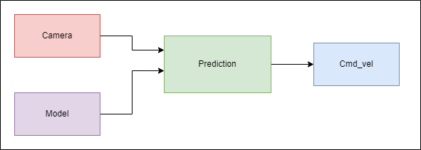
  <figcaption>
Figure 3: ROS workflow
</figcaption>

</figure>

## ROS Architecture

The node "data_collect" subscribes to two topics: "/color/preview/image" and "/cmd_vel". Once it has subscribed to the topics, it saves the image as a PNG file on the disk and creates a CSV file. To ensure that each image has a unique name, it imports the "Timestamp" module and uses it as the name of the image. After each image is saved, it updates the CSV file with the Timestamp, the path to the image, and the corresponding "linear_x" and "angular_z" values, as shown in Figure 3. You can find this code in "src → opencv_testing → opencv_testing → data_collect.py".
The model training is done without using ros so it does not have a ros architecture.
Deployment of the model is done with ros2. The node subscribes to the topic /color/preview/image and publishes to the topic /cmd_vel. It also imports the model.h which can be used for prediction. Image from the camera is given to the model and it gives the corresponding angular_z value which can be published to the topic /cmd_vel

<figure>

  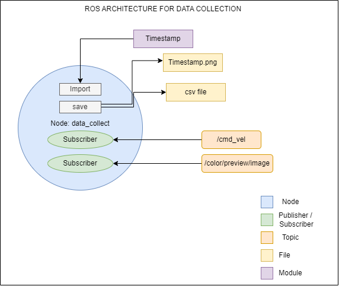
  <figcaption>
Figure 3: ROS II Architecture for Data Collection
</figcaption>

</figure>

<figure>

  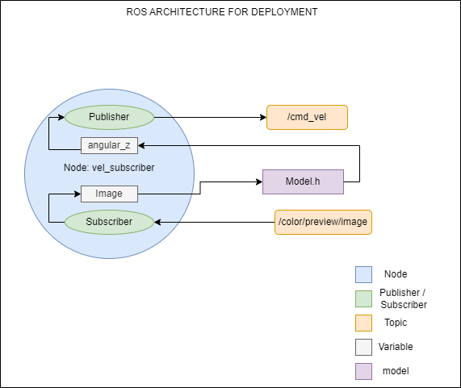
  <figcaption>
Figure 3: ROS II Architecture for model deployment
</figcaption>

</figure>

## Results and Conclusison

[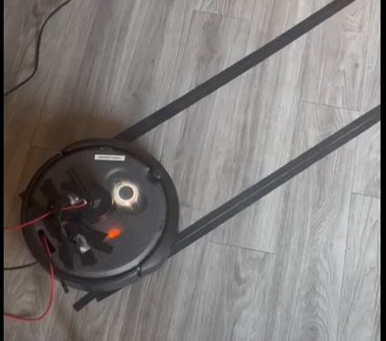](https://youtu.be/h4oOE15XZF0 "model deployment")

Video 2: Lane following sample 1

Video 3: Lane following sample 2

[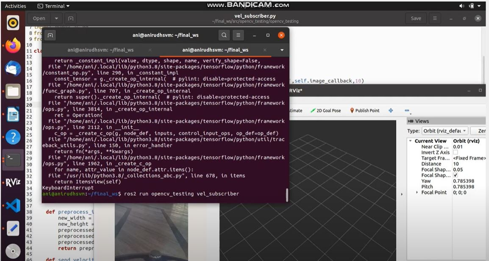](https://youtu.be/6sID9XOPbds "ROS II Preview")

Video 4: ROS II preview during deployment

Figure 1: Data collection experiment video

>Data

Working on Google colab we had limited resources, and due to that any image data set with more than 3000 images could not be trained as the system ran out of ram. Given more computing power we could have trained a larger dataset resulting in better accuracy. Having a bigger dataset can provide more variation in the training data. We can use different shapes of path for better learning tasks. To compensate for this we used data from the same path in both directions. We 
also balanced our dataset classes and removed the unnecessary images which improved it for training the model.

>Model

Regarding the model architecture, we attempted transfer learning using VGG16, which resulted in a higher accuracy of approximately 96% on the validation dataset. However, due to the large size of the VGG16 model, its deployment was considerably slower. Therefore, we decided to utilize a simpler CNN model, even though it was slightly less accurate, it was much faster than the VGG16 model.
