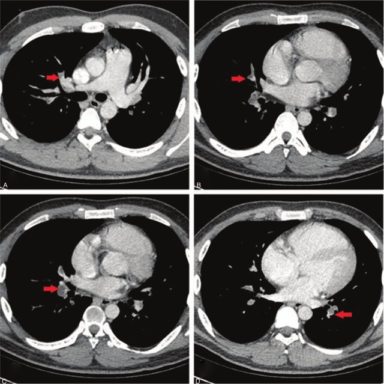
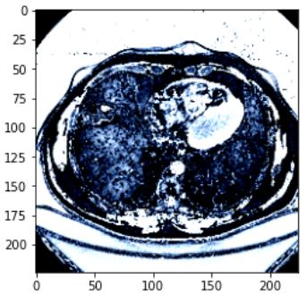
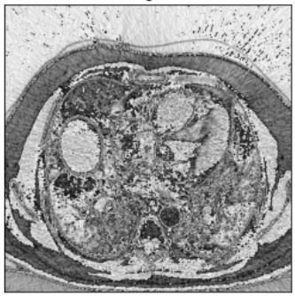
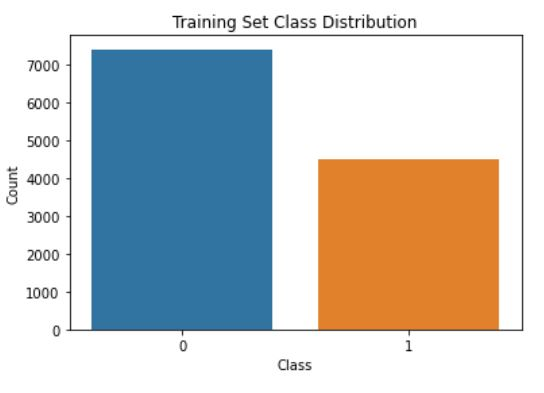
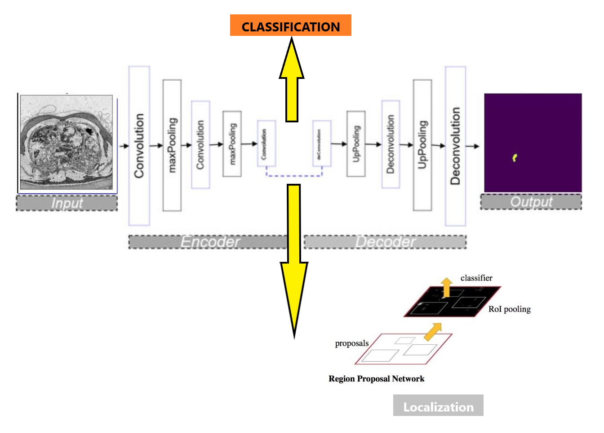
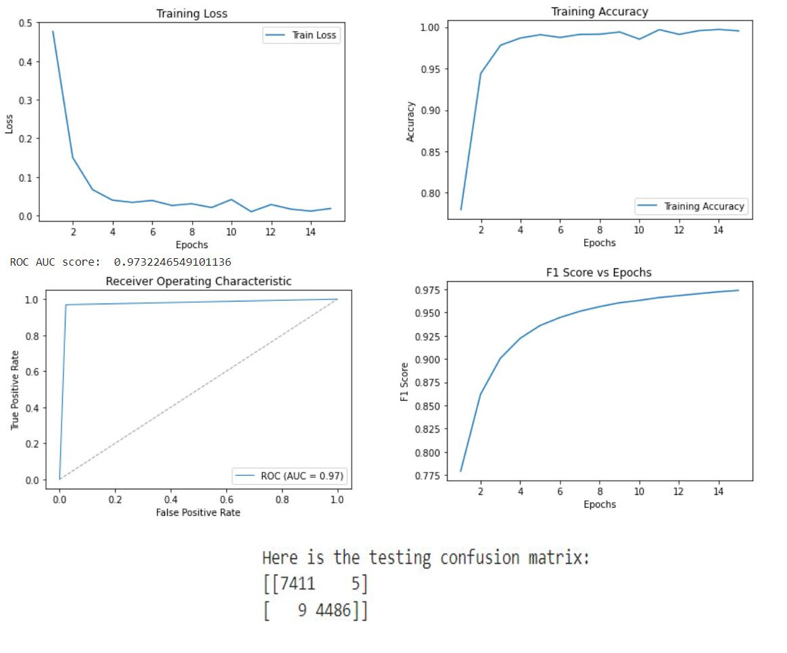
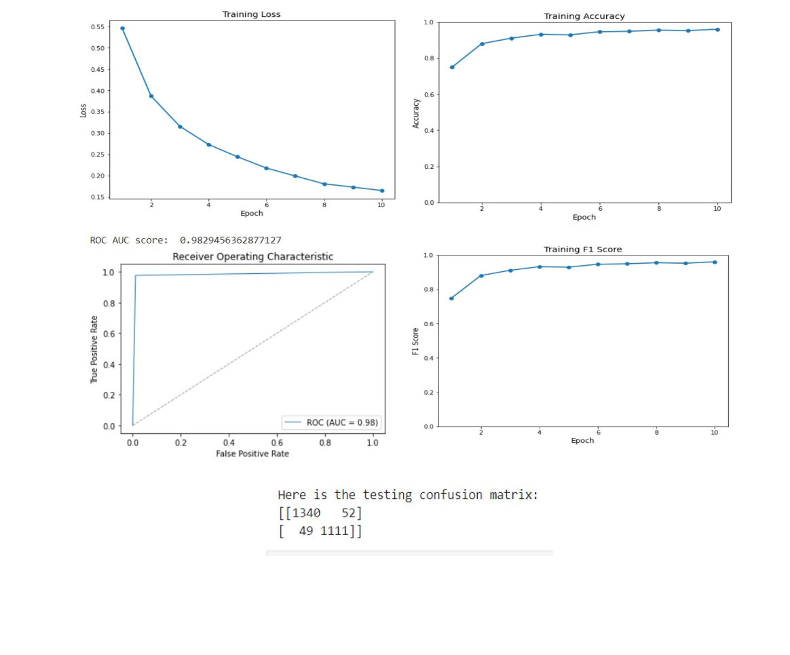

# Function Integration for CTPA Pulmonary Embolism: An Integrated Computer Vision Model for Classification, Segmentation and Localization.

## Abstract

Pulmonary embolism (PE) is a life-threatening condition that requires prompt and accurate detection using computed tomography pulmonary angiography (CTPA) scans. This study presents a novel integrated computer vision model that combines classification, segmentation, and localization tasks for efficient and precise PE detection in CTPA scans. Our model incorporates a deep learning architecture and employs a multi-task learning approach to simultaneously address the three core computer vision tasks. It was trained and tested on medical dataset of slice-level CTPA scans, with rigorous data preprocessing techniques applied. The model's performance was assessed using evaluation metrics such as accuracy, F1-score, DICE and IoU scores.

## Introduction

Pulmonary embolism (PE), a serious and potentially fatal condition, surpasses lung, breast, and colon cancer combined in its death toll. The current diagnostic standard, computed tomography pulmonary angiography (CTPA), suffers from rates of both under and over-diagnosis. To address these issues, this paper presents a comprehensive model applying deep learning techniques for enhanced computer-aided diagnosis (CAD). Leveraging the strengths of convolutional neural networks (CNNs) and transformers, our model performs multiple tasks such as classification, segmentation, and localization on slice-level CTPA images using a single training model. The evaluation employs supervised learning, pre-training models on specific tasks, and fine-tuning them for PE diagnosis. This integrated approach aims to reduce the need for multiple models, offering a more efficient and effective method for PE detection.

<figure>

  
  <figcaption>
Figure 1: Clinical Image used for PE Detection
</figcaption>

</figure>

## DataSet Information

The Radiological Society of North America (RSNA) provides a valuable dataset for advancing computer-aided diagnosis in pulmonary embolism (PE) detection. To mitigate this, we utilize 13,000 images, including 7,500 non-PE and 4,500 PE instances, selected randomly from the entire official dataset. In addition to the RSNA dataset, we utilize the FUMPE dataset, which contains computed-tomography angiography (CTA) images from 35 patients, with annotations at the slice level. This dataset is employed for training our segmentation and localization branches. To enhance localization, we adapt the FUMPE dataset's annotations to fit the widely recognized COCO dataset annotation format. By integrating both the RSNA and FUMPE datasets, we ensure our model benefits from diverse and comprehensive data sources for effective training and thorough performance evaluation in PE detection from CTPA scans.

<figure>
  <table>
    <tr>
      <td></td>
      <td></td>
      <td></td>
    </tr>
  </table>
  <figcaption>
Figure 2: Example of Slice Level RSNA and FUMPE Dataset
</figcaption>
</figure>

## Method

In our methodology, we performed several steps to assess the impact of reusing pre-trained branches for slice level PE classification and segmentation tasks. Initially, we trained the classification branch for PE classification. Subsequently, we trained the encoder-decoder (U-Net) branch for PE segmentation (baseline). Following these individual tasks, we trained the classification branch jointly with the U-Net branch for PE segmentation (baseline).
After establishing these baselines, we aimed to examine the benefits of reusing the pretrained branches. In Step 4, we reused the pretrained classification branch from Step 2 for PE classification, avoiding training from scratch. In Step 5, we reused the pre-trained U-Net branch from Step 3 for PE segmentation, again, without training from scratch. In Step 6, we reused both the pretrained classification branch from Step 2 and the pretrained U-Net branch from Step 3 for PE segmentation by the shared weights between both branches.

<figure>

 
 <figcaption>
Figure 3: Overall Model Architecture
</figcaption>

</figure>

## Model Architecture

Our unified model architecture accomplishes classification, segmentation, and localization tasks. We use ResNet as the backbone encoder for efficient feature extraction, along with the self-attention-based Swin Transformer. The model starts with a classification branch, trained with ImageNet 1k pretrained weights on the RSNA PE dataset. This provides reliable PE image classification, forming the basis for subsequent tasks. We then extend the classification branch to a U-Net architecture for the segmentation task, which accurately identifies and outlines PE regions in CTPA scans. This is achieved by capturing both high-level semantic information and fine-grained spatial details from the images. For localization, feature maps generated by the classification branch serve as the basis for region proposals within the Faster R-CNN network, known for its accurate object detection capabilities. Our comprehensive model streamlines the learning process, enhancing performance and speed, while maximizing resource efficiency. This leads to improved PE detection and potentially better patient outcomes.

 

## Slice Level Image Classification

Our classification model, a crucial part of our integrated architecture, differentiates between the presence and absence of pulmonary embolism in CTPA images. It leverages ResNet-50 and Swin Transformer Tiny backbones. ResNet-50, a deep convolutional neural network, excels at learning from numerous layers without performance degradation due to the vanishing gradient problem, thanks to its residual or skip connections. Swin Transformer Tiny, a recent architecture, delivers impressive results in computer vision tasks. With a hierarchical structure and local connections, it's well-suited for image analysis. Our model utilizes ImageNet 1k pretrained weights for initialization. ImageNet's large-scale dataset offers an advantageous starting point, enabling faster convergence and improved generalization when fine-tuning on the RSNA PE dataset, a balanced collection of CTPA images with and without pulmonary embolism. We apply various optimization techniques and monitor key metrics during training to enhance performance and gauge the model's effectiveness. The integration of ResNet and Swin Transformer Tiny backbones results in a robust foundation for subsequent segmentation and localization tasks, contributing to efficient pulmonary embolism detection.

<figure>

 
  <figcaption>
Figure 4: ResNet-50, ImageNet 1k pretrained model
</figcaption>

</figure>

<figure>

  
  <figcaption>
Figure 5: Swin Transformer Tiny, ImageNet 1k pretrained model
</figcaption>

</figure>

Our classification model, essential to our integrated architecture, uses the ResNet-50 and Swin Transformer Tiny backbones. ResNet-50, a deep neural network, learns effectively from numerous layers without performance degradation, due to its use of residual connections. Swin Transformer Tiny, a newer architecture, excels in computer vision tasks, offering a hierarchical structure and local connections suitable for image analysis. The combination of these architectures enhances feature extraction and representation in our model. To initialize, we employ ImageNet 1k pretrained weights, leveraging their encoded knowledge for faster model convergence and better generalization when fine-tuning on the RSNA PE dataset, composed of balanced CTPA images. During training, we apply optimization techniques and monitor key metrics like accuracy training loss, ROC, AUC score, and F1 score. This approach provides robust groundwork for subsequent tasks within our architecture, ensuring accurate CTPA image classification, and contributing to efficient pulmonary embolism detection.

## Slice Level Image Segmentation

